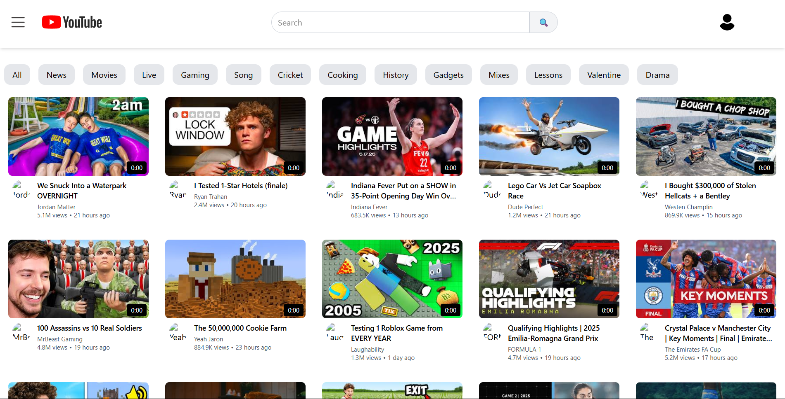

# YouTube 


A modern YouTube clone built with React 19, Redux Toolkit, and Tailwind CSS. This application replicates core YouTube features with a clean, responsive UI and real-time data from the YouTube API.

Try Now --- https://youtube-nine-khaki.vercel.app/



## ✨ Features

- **Responsive Design**: Fully responsive layout that works on desktop and mobile devices
- **Video Browsing**: Browse trending videos on the homepage
- **Video Playback**: Watch videos with a YouTube-like player interface
- **Search Functionality**: Search for videos with real-time suggestions
- **Related Videos**: View related video recommendations
- **Video Details**: See video statistics including views, likes, and publish date
- **Channel Information**: View basic channel details for each video
- **UI Components**: 
  - Header with search functionality
  - Category filter buttons
  - Video cards with thumbnails
  - Loading shimmer effects

## 🛠️ Technologies Used

- **React 19**: Latest version of React with improved performance
- **Redux Toolkit**: For efficient state management
- **React Router v7**: For navigation and routing
- **Tailwind CSS v4**: For styling and responsive design
- **Vite**: For fast development and optimized builds
- **YouTube Data API v3**: For fetching real video data

## 📋 Prerequisites

Before you begin, ensure you have:
- Node.js (v16 or higher)
- npm or yarn
- A YouTube Data API key

## 📱 Project Structure

```
youtube-clone/
├── public/             # Public assets
├── src/                # Source files
│   ├── App/            # Redux store and slices
│   ├── components/     # React components
│   │   ├── Header.jsx  # App header with search
│   │   ├── Body.jsx    # Main body component
│   │   ├── MainContainer.jsx # Homepage container
│   │   ├── VideoContainer.jsx # Video grid
│   │   ├── VideoCard.jsx # Individual video card
│   │   ├── WatchPage.jsx # Video player page
│   │   └── ...
│   ├── utils/          # Utility functions and constants
│   ├── App.jsx         # Main App component
│   └── main.jsx        # Entry point
├── .env                # Environment variables
├── package.json        # Dependencies and scripts
└── vite.config.js      # Vite configuration
```

## 🤝 Contributing

Contributions are welcome! Please feel free to submit a Pull Request.

1. Fork the repository
2. Create your feature branch (`git checkout -b feature/amazing-feature`)
3. Commit your changes (`git commit -m 'Add some amazing feature'`)
4. Push to the branch (`git push origin feature/amazing-feature`)
5. Open a Pull Request

Made with ❤️ by the YouTube Clone Team
